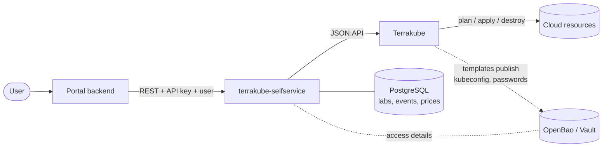
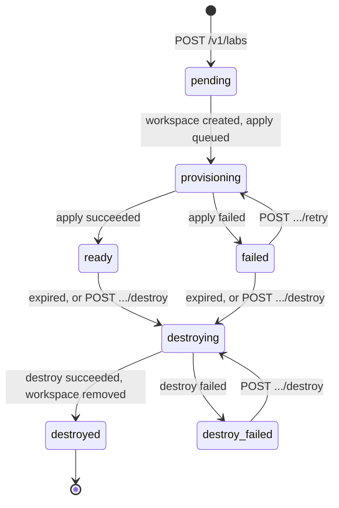

# Terrakube Self-Service

Self-service environments on top of [Terrakube](https://terrakube.io). Users open the built-in web portal (or any portal that calls the API), pick a template, fill in a form and get a **lab**: a Terraform/OpenTofu workspace that is applied for them, handed over with its access details, and destroyed automatically when its time runs out.



## What it gives you

| Feature | What users and admins get |
|---|---|
| **Web portal** | Built in and optional: sign in (OIDC, for example Dex), pick a template, see the cost while filling in the form, follow your labs, download access details, extend, retry or destroy; admins get usage and cost views. Plain HTML and JavaScript, no build step. |
| **Catalog with forms** | Templates are Git folders with a Terraform/OpenTofu module. Each declares typed form inputs (text, number, yes/no, choice; required, defaults, patterns, ranges). Portals build their forms from the API, so a new template needs no portal release. |
| **Lifetimes (TTL)** | Every lab has an expiry: a default and a maximum per template. Owners can extend up to the maximum. Expired labs are destroyed and their workspace removed, without anyone remembering to. |
| **Access handover** | Templates publish what the owner needs (kubeconfig, passwords, URLs) to OpenBao or Vault. The API returns it only to the owner or an admin, never cached, and records every read. |
| **Ownership** | Users see and act only on their own labs; admins see all. Users are identified by a verified OIDC token or by the portal. |
| **Cost estimates** | List prices from the catalog: an estimate before creating, the cost so far per lab, and a report per owner and template. |
| **Analytics and audit** | Labs per template and owner, failures, expiries, lifetimes, time to ready; a full event history per lab. |
| **Tidy Terrakube** | Lab workspaces sit in a `Self-service` project, tagged `lab_owner:<email>` and `expires_at:<UTC time>`, so admins can filter them in the Terrakube UI. |
| **Recovery** | Failed labs can be retried in place; failed or expired labs are still cleaned up. |

## How a lab moves



A background loop checks Terrakube every 30 seconds, moves labs along, and destroys expired ones. `destroy_failed` is the only state that needs a person: look at the Terrakube run, fix the cause, and destroy again.

## The portal

Enable it with the chart's `ui.*` values ([deployment](docs/deployment.md#web-portal)). It is served at `/ui`, typically published as `https://<host>/portal`, and uses the same rules as the API: users see only their own labs, admins see everything. Its pages live in [`app/ui_static/`](app/ui_static) (one HTML file, one JavaScript file, one stylesheet) and call `/ui/api/*`, the same endpoints as `/v1` with the user taken from the session.

For local development, run without sign-in as a fixed user:

```bash
UI_ENABLED=true UI_DEV_USER_EMAIL=you@example.com DATABASE_URL=... API_KEYS=dev CATALOG_PATH=examples/catalog.yaml \
  TERRAKUBE_ORGANIZATION=org TERRAKUBE_UI_URL=https://terrakube.example.com TERRAKUBE_TOKEN=... \
  uvicorn app.main:create_app --factory --port 8080      # then open http://localhost:8080/ui/
```

## Quickstart: a lab in five calls (API)

All requests carry the portal's API key and the user (see [identity](docs/portal-integration.md#2-identify-the-user-on-every-call)).

```bash
H=(-H "Authorization: Bearer $API_KEY" -H "X-Actor-Email: alice@example.com" -H "Content-Type: application/json")
URL=http://terrakube-selfservice:8080

# 1. What can I create, and with which form?
curl -s "${H[@]}" $URL/v1/templates | jq '.items[] | {id, name, inputs: [.inputs[].name]}'

# 2. What will it cost?
curl -s "${H[@]}" -X POST $URL/v1/templates/lke-lab/estimate -d '{"inputs": {"node_pool_instance_count": 2}, "ttl_hours": 4}'
# {"currency": "USD", "hourly": 0.087, "ttl_hours": 4, "total": 0.35, "items": [...]}

# 3. Create it (name and owner are optional: a random name, owned by the caller)
LAB=$(curl -s "${H[@]}" -X POST $URL/v1/labs -d '{"template_id": "lke-lab", "ttl_hours": 4, "inputs": {"node_pool_instance_count": 2}}' | jq -r .id)

# 4. Wait for ready (poll every 15-30 s)
curl -s "${H[@]}" $URL/v1/labs/$LAB | jq '{status, status_detail, expires_at, estimated_cost}'

# 5. Get the access details
curl -s "${H[@]}" $URL/v1/labs/$LAB/access | jq -r .values.kubeconfig > lab.kubeconfig
```

The service also serves interactive API docs at `/docs` and the contract at `/openapi.json` ([`openapi.yaml`](openapi.yaml) in this repository).

## API at a glance

| Endpoint | Who | Purpose |
|---|---|---|
| `GET /v1/templates`, `GET /v1/templates/{id}` | any user | Templates and their form inputs |
| `POST /v1/templates/{id}/estimate` | any user | Cost estimate for form inputs and a lifetime |
| `POST /v1/labs` | any user | Create a lab |
| `GET /v1/labs`, `GET /v1/labs/{id}` | owner, admin | Labs, status, expiry, cost so far |
| `GET /v1/labs/{id}/access` | owner, admin | Access details of a ready lab (audited) |
| `POST /v1/labs/{id}/extend` | owner, admin | Add hours, up to the template's maximum |
| `POST /v1/labs/{id}/retry` | owner, admin | Re-run a failed lab's apply |
| `POST /v1/labs/{id}/destroy` | owner, admin | Destroy now |
| `GET /v1/labs/{id}/events` | owner, admin | History of the lab |
| `GET /v1/analytics/summary`, `/timeseries` | admin | Usage |
| `GET /v1/analytics/costs` | admin | Estimated cost per owner and template |

Other users' labs answer `404`, as if they did not exist.

## Documentation

| Read this | If you |
|---|---|
| [Portal integration](docs/portal-integration.md) | connect another portal or tool to the API: security rules, screens, calls, errors, checklist |
| [Catalog reference](docs/catalog.md) | write templates: inputs, lifetimes, cost models, variables labs receive |
| [Deployment](docs/deployment.md) | run the service: Helm values, identity, OpenBao, Terrakube setup, operations |
| [Changelog](CHANGELOG.md) | upgrade: what changed per version |

## Development

```bash
python -m venv .venv && . .venv/bin/activate
pip install -e ".[test]"
docker run -d --name tss-db -e POSTGRES_PASSWORD=pw -p 5432:5432 postgres:17-alpine
TEST_DATABASE_URL=postgresql://postgres:pw@localhost:5432/postgres PYTHONPATH=.:tests pytest tests
python -m scripts.export_specs   # regenerate openapi.yaml and the catalog/chart schemas
```

Tests fail when the committed specs are stale. Releases: push a `vX.Y.Z` tag to publish the image `ghcr.io/<owner>/terrakube-selfservice:X.Y.Z` and the chart `oci://ghcr.io/<owner>/charts/terrakube-selfservice:X.Y.Z`. Pushes to `main` publish an image tagged with the commit SHA.

## License

[MIT](LICENSE)
