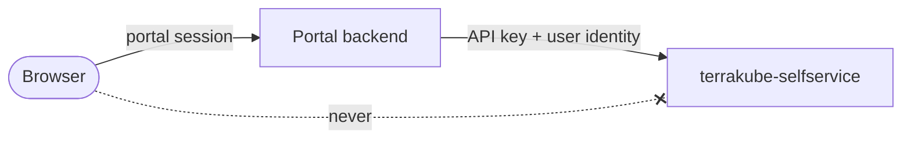
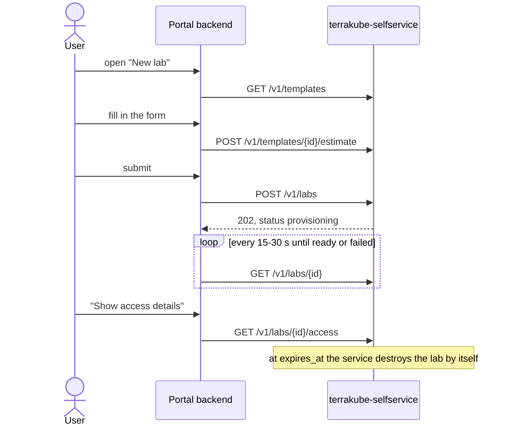

# Portal integration

What another portal or tool needs to do to offer labs to its users through the `/v1` API. If the [built-in portal](../README.md#the-portal) is enough, none of this is needed: link users to it instead. The API contract is [`openapi.yaml`](../openapi.yaml), also served at `/openapi.json` with interactive docs at `/docs`. This guide covers what the contract cannot: the security rules, which calls sit behind which screen, and how to show results. The [checklist](#6-checklist) at the end is the short version.

## 1. Call the service from the portal backend only



- **The browser never calls the service.** The API key and every response pass through the portal backend.
- **Keep the API key server-side**, in the portal's secret store, never in frontend code, HTML or browser storage.
- **Rotation without downtime:** the service accepts several keys. Add the new key, switch the portal, then remove the old one.
- **Network:** the service is cluster-internal by default and is exposed only as far as the portal backend needs.

## 2. Identify the user on every call

Every lab call acts on behalf of one user. Users only see and change their own labs; another user's lab answers `404`, so its existence is not revealed. Admins see all labs and the analytics.

Use one of two modes (the service operator configures which):

| Mode | Header | The portal must |
|---|---|---|
| **Token (recommended)** | `X-User-Token: <OIDC ID token>` | Forward the signed-in user's ID token unchanged. The service verifies its signature, issuer, audience and expiry and uses its `email` claim, so even a portal bug cannot act as another user. |
| **Header** | `X-Actor-Email: <email>` | Set it **only from the portal's own authenticated session**, never from a request parameter, form field, cookie or anything else the browser sends. The service trusts it completely. |

A missing or invalid identity gets `401`. In token mode `X-Actor-Email` is ignored. If the portal cannot guarantee that users are unable to change the email it sends, use token mode.

## 3. A lab's life, as the portal sees it



## 4. Screens and the calls behind them

### New lab: catalog and form

`GET /v1/templates` returns every template with its form. Build the form from it rather than hard-coding templates: the catalog changes without a portal release.

```json
{"items": [{
  "id": "lke-lab", "name": "LKE cluster", "description": "...",
  "default_ttl_hours": 8, "max_ttl_hours": 72,
  "inputs": [
    {"name": "node_pool_instance_type", "label": "Node instance type", "type": "enum",
     "options": ["g6-standard-2", "g6-standard-4"], "default": "g6-standard-2", "required": false},
    {"name": "node_pool_instance_count", "label": "Node count", "type": "number",
     "minimum": 1, "maximum": 10, "default": 3, "required": false}
  ]
}]}
```

| `inputs[].type` | Widget | Send as |
|---|---|---|
| `string` | text field; check `pattern` if present | string |
| `number` | number field; enforce `minimum` / `maximum` | number |
| `boolean` | checkbox or toggle | `true` / `false` |
| `enum` | select from `options` | one of `options` |

- Pre-fill `default`, mark `required`, show `label` and `description`. `sensitive` inputs are password fields.
- Offer a lifetime from 1 hour to `max_ttl_hours`, defaulting to `default_ttl_hours`.
- The service validates everything again; show its `422` messages next to the form.

**Show the cost while the user fills in the form.** Call the estimate whenever inputs or lifetime change (debounced):

```http
POST /v1/templates/lke-lab/estimate
{"inputs": {"node_pool_instance_count": 2}, "ttl_hours": 4}
```
```json
{"currency": "USD", "hourly": 0.087, "ttl_hours": 4, "total": 0.35,
 "items": [{"label": "Worker nodes", "hourly": 0.072}, {"label": "NodeBalancer (ingress-nginx)", "hourly": 0.015}]}
```

Show `total` for the chosen lifetime and `hourly`, labelled as an estimate. `404` means the template has no cost model: hide the estimate.

### Create

```http
POST /v1/labs
{"template_id": "lke-lab", "ttl_hours": 4, "inputs": {"node_pool_instance_count": 2}}
```

- `owner_email` defaults to the user; only admins may create labs for someone else (`403` otherwise).
- `name` is optional. Omit it and the service picks `<owner>-<5 random chars>`, for example `alice-k3x9p`. If users may choose one, handle `409` (name taken).
- The answer is `202` with the new lab in `provisioning`; open its page.

### My labs and the lab page

`GET /v1/labs` lists the user's labs; `?include_destroyed=true` adds history. Admins get everyone's labs and can filter with `?owner_email=`.

`GET /v1/labs/{id}`:

```json
{
  "id": "6d138dae-e5c7-4983-bf82-d2db8574a9f0", "name": "alice-k3x9p", "template_id": "lke-lab",
  "owner_email": "alice@example.com", "status": "ready", "status_detail": null,
  "inputs": {"node_pool_instance_count": "2", "node_pool_instance_type": "g6-standard-2"},
  "created_at": "2026-09-30T08:50:32Z", "ready_at": "2026-09-30T08:55:01Z", "expires_at": "2026-09-30T12:50:32Z",
  "extension_count": 0, "currency": "USD", "estimated_hourly_cost": 0.087, "estimated_cost": 0.12,
  "workspace_url": "https://terrakube.example.com/organizations/.../workspaces/..."
}
```

- While `pending` or `provisioning`, **poll every 15 to 30 seconds** and stop when the status settles (`ready`, `failed`, `destroyed`, `destroy_failed`). Provisioning takes minutes.
- Show `expires_at` in the user's time zone with a countdown, `status_detail` when present, and `estimated_cost` (so far) and `estimated_hourly_cost` with `currency`, labelled as estimates.
- `workspace_url` links to the Terrakube run logs, for users who can open Terrakube.

| Status | Show | Offer |
|---|---|---|
| `pending`, `provisioning` | progress, `status_detail` | Destroy |
| `ready` | expiry countdown, cost so far | Show access details, Extend, Destroy |
| `failed` | `status_detail` | Retry, Destroy |
| `destroying` | progress | nothing |
| `destroy_failed` | "cleanup needs attention" | Destroy again; tell an admin |
| `destroyed` | when and why (`destroy_reason`) | nothing |

`GET /v1/labs/{id}/events` returns the lab's history (created, provisioned, extended, access viewed, expired, destroyed, with who and when) for an activity list.

### Access details (secrets)

`GET /v1/labs/{id}/access` returns what the template published for a `ready` lab:

```json
{"lab_id": "6d138dae-...", "name": "alice-k3x9p",
 "values": {"kubeconfig": "apiVersion: v1\n...", "cluster_name": "lke-cluster-1a2b3c4d", "ingress_ip": "203.0.113.10"}}
```

- **Fetch only when the user asks**, for example a "Show access details" button, never when loading the lab page.
- **Do not cache, store or log it.** The service sends `Cache-Control: no-store`; keep that header towards the browser and exclude this route from request logging and APM payload capture.
- Offer multi-line values (a kubeconfig) as a download named `<lab name>.kubeconfig`, and short secrets behind a reveal-and-copy button.
- Every read is recorded in the lab's history as `access_viewed`, with the user.
- `409`: not ready yet. `404`: the template published nothing, or not this user's lab. `501`: not configured on this installation.

### Extend, retry, destroy

| Action | Call | Notes |
|---|---|---|
| Extend | `POST /v1/labs/{id}/extend` `{"hours": 4}` | Capped at the template's `max_ttl_hours` from creation; `409` when the cap is reached. The cost grows at the same hourly price. |
| Retry | `POST /v1/labs/{id}/retry` | Re-runs a `failed` lab's apply in its workspace; `409` explains when that is not possible |
| Destroy | `POST /v1/labs/{id}/destroy` `{"reason": "done"}` | Ask for confirmation first. The lab goes to `destroying`, then `destroyed` |

### Admin views

For admins only (`403` for other users):

- `GET /v1/analytics/summary?days=30`: labs by status, `active_labs`, `needs_attention` (labs whose cleanup failed), created, destroyed, expired, failures, and per template: lifetimes and time to ready.
- `GET /v1/analytics/timeseries?days=30`: created, destroyed and expired labs per day, for a chart.
- `GET /v1/analytics/costs?days=30`: total lab-hours and estimated cost, then each owner split by template, then per template. Show its `method` text next to the numbers, so readers know they are list-price estimates.

## 5. Errors

Every error body is `{"detail": "..."}`; for `422` it is a list of field errors.

| Code | Meaning | Portal behaviour |
|---|---|---|
| 401 | Bad API key, or missing or invalid user identity | Alert operators (key), or sign the user in again (token) |
| 403 | Not allowed for this user | Hide admin-only actions |
| 404 | Not found, or another user's lab | Treat both as "lab not found" |
| 409 | Not possible in the lab's current state | Show `detail` and reload the lab |
| 422 | Invalid input | Show next to the form fields |
| 501 | Feature not configured | Hide the feature |
| 502 | Terrakube or OpenBao call failed | "Try again later"; the lab records what happened |

## 6. Checklist

- [ ] The service is called from the portal backend only; the API key never reaches a browser.
- [ ] Users are identified by token mode, or by header mode with the email taken from the portal's session only.
- [ ] Forms are built from `GET /v1/templates` and show the estimate before submitting.
- [ ] Polling stops when the status settles and backs off on errors.
- [ ] Access details are fetched on demand and never cached, stored or logged.
- [ ] Destroy asks for confirmation.
- [ ] Admin-only views are hidden from other users.
